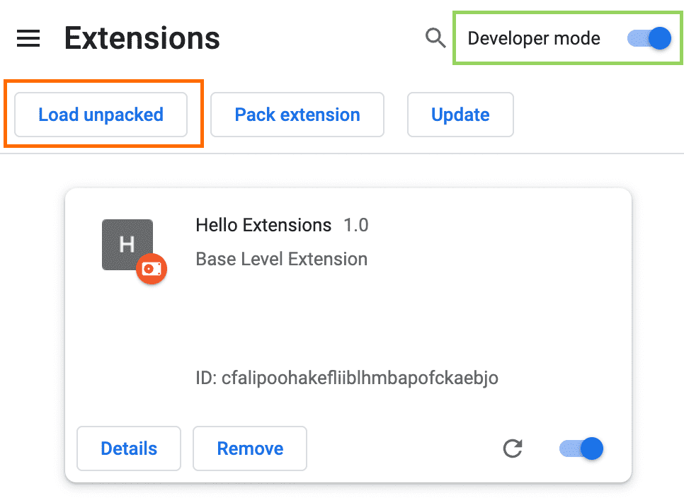

# Contribute

## Loading the Unpacked Extension into Chrome

Follow these steps to load the unpacked extension into your Chrome browser:

### Step 1: Download the Extension Package

1. **Go to the Release Page**: Visit the [Release Page](https://github.com/danduh/e2e-ids-finder/releases).
2. **Download the Latest Release**: Select the latest release and download the `package.zip` file.

### Step 2: Unpack the Extension

1. **Unzip the File**: Locate the downloaded `package.zip` file on your computer and unzip it. You can use any standard unzip tool.
2. **Extract the Contents**: Extract the contents of the zip file to a folder on your computer. Make sure you remember the location of this folder.

{align=right width=350}

### Step 3: Load the Unpacked Extension into Chrome

1. **Open Chrome**: Launch the Google Chrome browser on your computer.
2. **Access Extensions Page**: Navigate to [Extensions Page](chrome://extensions/)
3. **Enable Developer Mode**: In the Extensions page, enable **Developer mode** by toggling the switch in the upper right corner of the page.
4. **Load Unpacked Extension**: Click the **Load unpacked** button.
5. **Select the Extension Folder**: In the file dialog that opens, navigate to the folder where you unpacked the extension files and select it. Click **Select Folder**.

### Step 4: Verify the Extension is Loaded

1. **Check Extension List**: The extension should now appear in your list of installed extensions. Ensure that it is enabled.
2. **Pin the Extension (Optional)**: For easy access, you can pin the extension to the Chrome toolbar by clicking on the extension icon next to the address bar and selecting the pin icon.

### Notes

- **Updating the Extension**: If you need to update the extension, repeat the steps to download the latest version and load it as an unpacked extension. Chrome will prompt you to replace the existing one.
- **Troubleshooting**: If the extension does not load, ensure that all files are correctly extracted and that there are no missing files. Check the Chrome console for any error messages.
