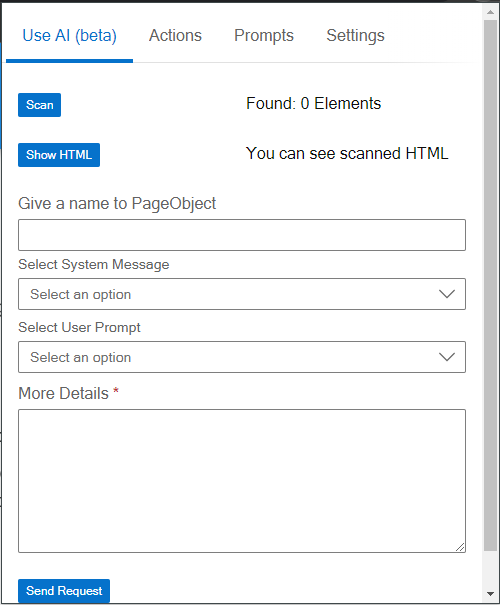

# Getting Started

This guide will walk you through the steps to use the extension effectively for generating page objects for your tests.

{ align=right }
## Step 1: Scan Elements

- **Initiate Scan**: Click the "Scan" button to begin scanning all elements on the page with a predefined attribute.
- **View Results**: The extension will display the number of elements found with the specified attribute. It also provides a **Show HTML** view to see all elements and their HTML, which will be sent to the AI for page object generation.

## Step 2: Define Page Object Name

**Name the Page Object**: Enter a meaningful and descriptive name for the page object. 
Providing a correct and meaningful name is important as it helps improve the clarity and usefulness of the generated page object in your tests.

## Step 3: Select or Define Prompts

- **System Message**: Choose a system message from the list of predefined messages managed in the Prompts section. This message provides the AI with the context and rules for generating the page object.
- **User Prompts**: Select or define user prompts that describe what you want to do with the page object. 
- You can provide additional details in **More Details** field to be included in the final prompt sent to the AI.

## Step 4: Generate Page Object

- **Send Request**: Click the "Send Request" button to submit the request to the AI. The request includes the HTML of the elements, the page object name, the selected system message, and user prompt.
- **Wait for Response**: The time taken for the AI to generate the page object depends on the model being used. Please be patient while the AI processes the request.

## Step 5: Review and Save Page Object

- **View Generated Page Object**: Once the AI responds, the generated page object will be displayed.
- **Save or Copy**: You have the option to save the generated page object as a file or copy the code to your clipboard.

## Example Workflow

- **Scan Elements**: Click "Scan" and view the number of elements found with the predefined attribute.
- **Name Page Object**: Enter a name like "LoginPage" to describe the page object.
- **Select Prompts**:
  - **System Message**: Select "Default System Message" that provides context such as "Generate a page object for testing."
  - **User Prompt**: Enter "This page object should include methods for logging in and error handling."
- **Generate Page Object**: Click "Send" and wait for the AI to process.
- **Save/Copy Code**: Once generated, copy the code and paste it into your project.

## Notes

- **Meaningful Names**: Always use descriptive names for page objects to improve the clarity and usefulness of the generated code.
- **Detailed Prompts**: The more detailed your prompts, the more accurate and useful the generated page object will be.
- **Save Regularly**: Regularly save your configuration and generated objects to avoid losing any data.

By following these steps, you can efficiently generate page objects tailored to your testing needs, enhancing your testing process and improving overall productivity.
