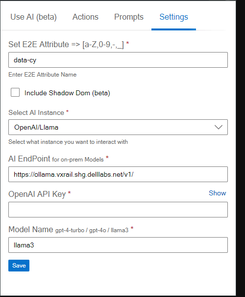

# E2E Test Helper Extension

The **E2E Test Helper Extension** is designed to simplify and enhance your end-to-end testing workflow by leveraging AI to generate page objects. This extension integrates seamlessly with popular testing frameworks like Cypress and Playwright, enabling you to create robust, reusable page objects quickly and efficiently.

{ align=right }
## Key Features

- **Element Scanning**: Automatically scan your web pages to identify elements based on a predefined attribute. This feature helps you quickly locate elements that will be used to generate page objects.
- **Customizable Prompts**: Define and manage both system and user prompts to tailor the AI's behavior to your specific testing needs. Customize the responses to ensure they align perfectly with your testing requirements.
- **Support for Shadow DOM**: Enable the inclusion of elements within Shadow DOM, allowing you to work with modern web components effortlessly.
- **Flexible AI Integration**: Choose from various AI instances, including OpenAI, LLaMA, and Azure AI. Configure the AI model, API endpoint, and other settings to match your development environment.
- **Efficient Page Object Generation**: Generate page objects with meaningful names and detailed prompts. The extension sends the HTML elements and your instructions to the AI, which returns a complete page object ready for use in your tests.
- **Easy Export Options**: Save the generated page objects as files or copy the code directly to your clipboard. This makes it easy to integrate the generated code into your existing codebase.

## How It Works

1. **Scan Elements**: Begin by scanning the web page to identify elements with the specified attribute.
2. **Define Page Object**: Provide a meaningful name for the page object and select or define prompts to guide the AI in generating the page object.
3. **Generate and Save**: Send the request to the AI and wait for the response. Once the page object is generated, you can save it as a file or copy the code.

## Getting Started

To get started, follow these simple steps:

1. **Install the Extension**: Add the E2E Test Helper Extension to your Chrome browser from the [Chrome Web Store](https://chromewebstore.google.com/detail/e2e-test-helper/ojimkloafomebgljfeibknkffenmabgj).
2. **Configure Settings**: Navigate to the [Settings tab](/settings) to configure your preferences, including the E2E attribute, AI instance type, API endpoint, and model name.
3. **Manage Prompts**: Go to the [Prompt Manager](/prompts) tab to define and manage system and user prompts.
4. **[Start Scanning](/getting-started)**: Use the Scan button to identify elements on your web page and generate page objects with the help of AI.

## Why Use E2E Test Helper?

- **Save Time**: Automate the tedious process of writing page objects, freeing up your time to focus on writing tests.
- **Consistency**: Ensure consistent and reusable page objects across your test suite.
- **Customization**: Tailor the AI-generated page objects to fit your specific testing framework and coding standards.
- **Advanced Features**: Take advantage of advanced features like Shadow DOM support and flexible AI integration to handle complex web applications.

[//]: # (## Support and Feedback)

[//]: # ()
[//]: # (We are committed to providing the best possible experience with the E2E Test Helper Extension. If you have any questions, need support, or want to provide feedback, please visit our [Support Page] or contact us at [support@example.com].)

[//]: # ()
[//]: # (Thank you for using the E2E Test Helper Extension! Happy testing!)
