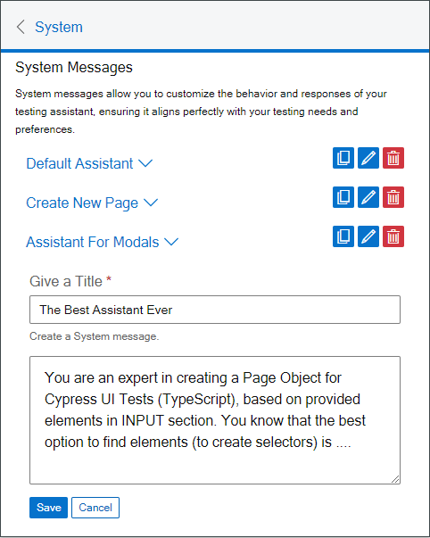

# Prompts Manager

The **Prompt Manager Tab** is a central hub where you can add, manage, and remove prompts. It consists of two types of prompts: **System Messages** and **User Messages**.

{ align=right }

## System Messages

System Messages allow you to customize the behavior and responses of your testing assistant. By defining system messages, you can ensure that the assistant aligns perfectly with your testing needs and preferences. These messages can help specify how you want page objects for tests to be created, whether it's for Cypress, Playwright, or any other testing framework. Additionally, you can provide context on handling specific page objects and specify the programming language (e.g., TypeScript, JavaScript, Java, Python) you prefer.

In essence, system messages set the default context and rules for the assistant. For example, you might instruct the assistant to create page objects in a specific way or to follow particular guidelines.

## User Messages

User Messages are prompts created by you, the user, to guide the assistant during your interactions. These can be tailored to fit specific scenarios or to provide additional instructions that go beyond the predefined system messages.

## Features

- **Predefined System Messages**: The extension comes with a list of predefined system messages that you can use as a starting point.
- **Clone and Edit**: You can clone these predefined messages and edit them to better suit your needs.
- **Create New Messages**: You can create new system messages by providing a title and the message content.
- **Delete Messages**: Unnecessary messages can be deleted to keep your prompt list clean and relevant.

## How to Use

1. **View Existing Messages**: The Prompt Manager displays a list of predefined system messages.
2. **Clone and Edit**: Select a predefined message, clone it, and edit the title and content as needed.
3. **Delete Messages**: Remove any message that is no longer required by selecting it and clicking the delete button.
4. **Create New Messages**: Add new system messages by providing a title and the message content. This allows you to define how the assistant should handle specific tasks or page objects.

By managing your system and user messages, you can tailor the assistant to provide precise and helpful responses, ensuring an efficient and effective process for creating page objects for your tests.
