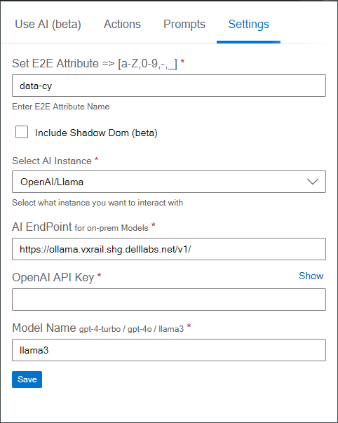

# Settings

The **Settings Page** allows you to configure various options that define how the assistant will interact with your web elements and create page objects. Below are the configurations available:

{ align=right }
## End-to-End Attribute

This is the most important setting. The End-to-End (E2E) attribute is used by the AI to locate elements and create the necessary page objects. 
By default, the attribute is set to `data-testid`. 
In many cases, such as when using Cypress, this attribute might be `data-cy`, but you can customize it to any value you use in your code.

## Include Shadow DOM

This is an experimental feature that allows the AI to delve deeper into web components that use Shadow DOM. 
Enabling this option ensures that elements within the Shadow DOM are also located and used in the creation of page objects, using the specified E2E attribute.

## AI Instance Type

Here, you can select the type of AI instance you are working with. The available options are:
- **OpenAI**: For using OpenAI's API.
- **LLaMA**: For using the LLaMA API.
- **Azure AI**: For Azure AI instances, which might have different API communication methods, especially for on-premises instances.

## API Endpoint

If you are using a private or on-premises instance of the AI model, you can specify the base URL of the API endpoint here.

## API Key

This field is for entering the API key required to authenticate with your AI instance. 
This could be an OpenAI API key, an Azure API key, or any other relevant API key depending on the AI instance type you selected.

## Model Name

Specify the name of the model you are working with. Some examples include:
- `gpt-4-turbo` for OpenAI's GPT-4 Turbo.
- `llama-3` for LLaMA 3.
  You can enter any model name that your selected AI instance supports.

## Save Configuration

After updating the settings, click the **Save** button to apply the changes. 
It is crucial to save the configurations to ensure that the assistant uses the updated settings during its operations.

## Example of Usage

1. **E2E Attribute**: Set this to `data-cy` if you are using Cypress and your elements are identified with `data-cy` attributes.
2. **Include Shadow DOM**: Enable this option if your application uses web components and you need to locate elements within the Shadow DOM.
3. **AI Instance Type**: Choose `OpenAI` if you are using the OpenAI API, or `Azure AI` if you are using an Azure on-premises instance.
4. **API Endpoint**: If using a custom AI instance, provide the base URL of your API.
5. **API Key**: Enter the appropriate API key for your selected AI instance.
6. **Model Name**: Specify the model name, such as `gpt-4-turbo`.

## Note

Always remember to click **Save** after making any changes to the settings to ensure they are applied correctly.

